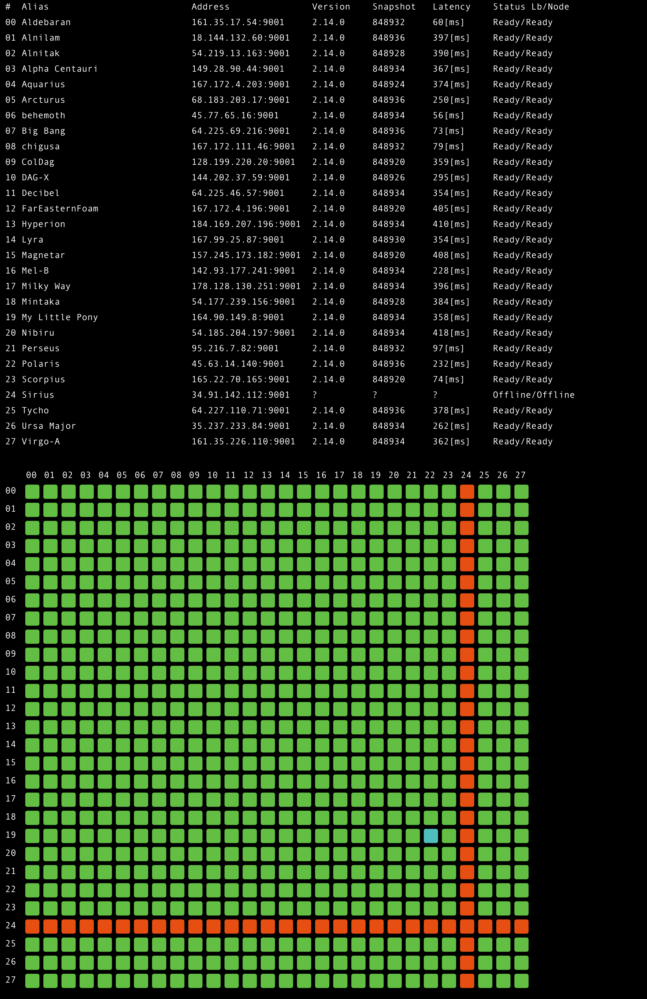
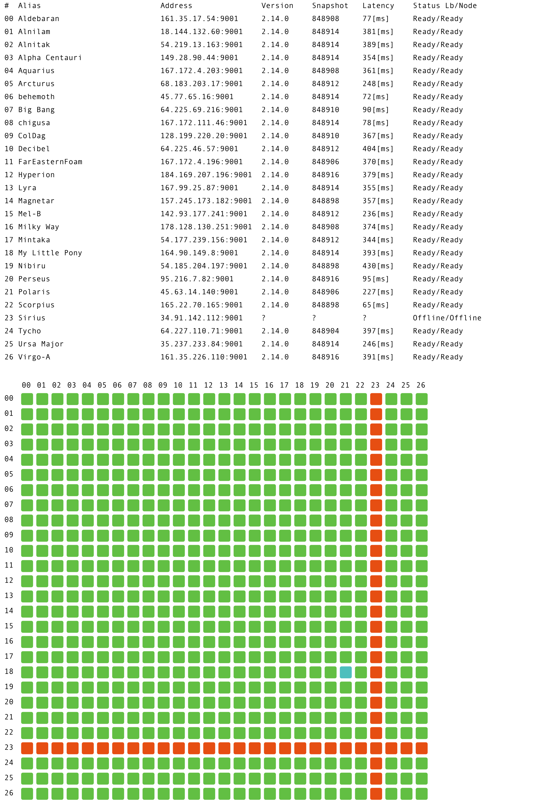

# Constellation Hypergraph Network monitoring cli tool

For implementation of Constellation Hypergraph network application check the [official repo](https://github.com/Constellation-Labs/constellation).

## Nodegrid
To run nodegrid command against MainNet execute

    cl_cli nodegrid http://lb.constellationnetwork.io:9000
    
The result should be similar to the one below:

You can also ask for image output instead of ASCII, add `--silent` and `--image=filename.png` flags to get PNG image for network status grid

    cl_cli nodegrid http://lb.constellationnetwork.io:9000 --image=grid.png --silent

File produced by the tool will look like the image, a PNG with by default transparent background:

You can switch image theme between transparent,dark and light.

    cl_cli nodegrid http://lb.constellationnetwork.io:9000 --image=grid.png --silent --theme=dark
    

    cl_cli nodegrid http://lb.constellationnetwork.io:9000 --image=grid.png --silent --theme=light

## Nodemon

Nodemon command utilizes Nodegrid capabilties to build the network status overview. When executed it notifies 
Discord webhook on node status changes between other then Ready and SnapshotCreation states. The previous
network state is stored by default in a $HOME directory in `network-status` file, webhook url is taken from $HOME 
`webhook` file. Both paths can be overridden with commandline flags along with theme flag. 

    nodemon http://lb.constellationnetwork.io:9000 --theme=dark
    
### Roadmap
 - Code cleanup/rewrite for image/ascii output