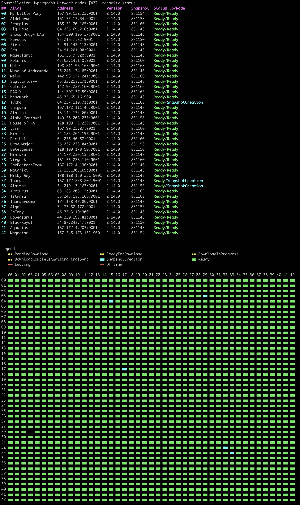
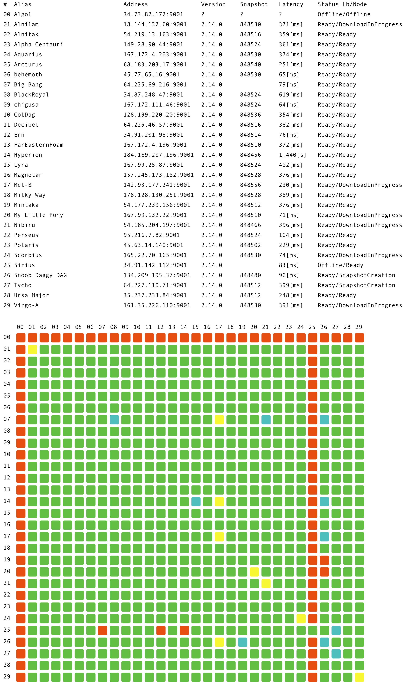

# Constellation Hypergraph Network monitoring cli tool

For implementation of Constellation Hypergraph network application check the [official repo](https://github.com/Constellation-Labs/constellation).

## Nodegrid
To run nodegrid command against MainNet execute

    cl_cli nodegrid http://lb.constellationnetwork.io:9000
    
The result should be similar to the one below:

You can also ask for image output instead of ASCII, add `--silent` and `--image=filename.png` flags to get PNG image for network status grid

    cl_cli nodegrid http://lb.constellationnetwork.io:9000 --image=grid.png --silent

File produced by the tool will look like the image, a PNG with transparent backgroun:

### Roadmap
 - Code cleanup/rewrite for image/ascii output